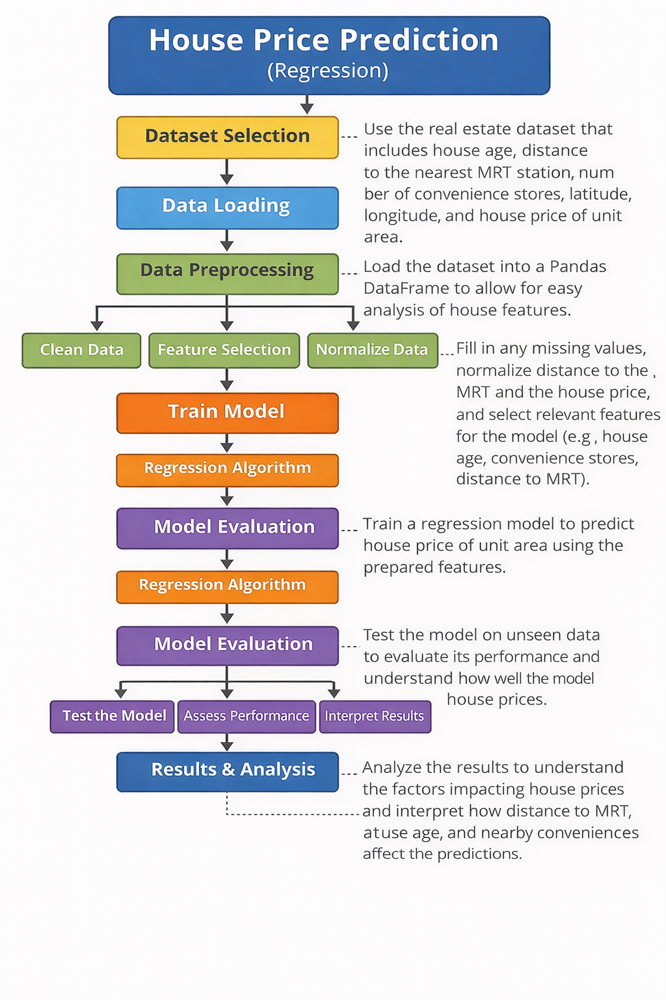

# ARTI308-Lab2-House-Price-Prediction
### Project Description
This project focuses on predicting house prices using machine learning techniques. The objective is to predict the house price of a unit area based on several property and location-related features. This problem is considered a regression problem because the target variable is a continuous numerical value. The dataset used contains real estate transaction data from an urban area. Each row represents a single property transaction and includes features such as house age, distance to the nearest MRT station, number of nearby convenience stores, and geographical location (latitude and longitude). This dataset is suitable for regression analysis and helps in understanding how different factors influence property prices.

---

### Jupyter Notebook

The dataset loading and inspection steps are implemented in the Jupyter Notebook below:

[View Notebook – Lab 2 ML House Price](https://github.com/Zahoooor05/ARTI308-Lab2-House-Price-Prediction/blob/main/Lab%202%20ML_house_price_ml.ipynb)

---

### Methodology Diagram

  

The methodology diagram illustrates the workflow of the project, including dataset selection, data loading, preprocessing, model training, and evaluation.  
(The diagram was generated using an AI-assisted tool.)

---

### Submission
This repository is submitted as part of **ARTI 308 – Machine Learning (Lab 2)** .
